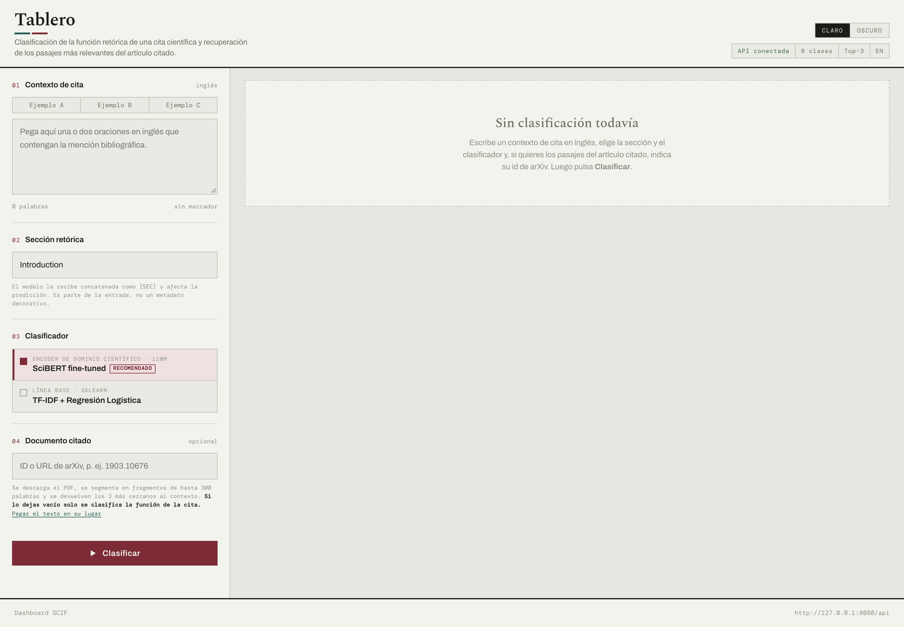
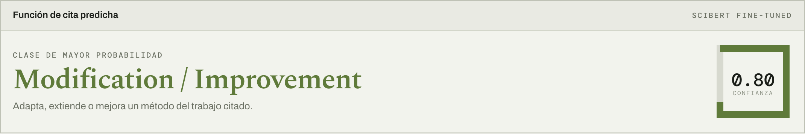
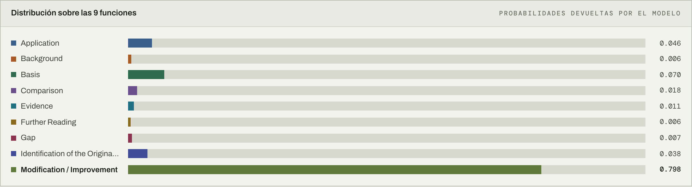
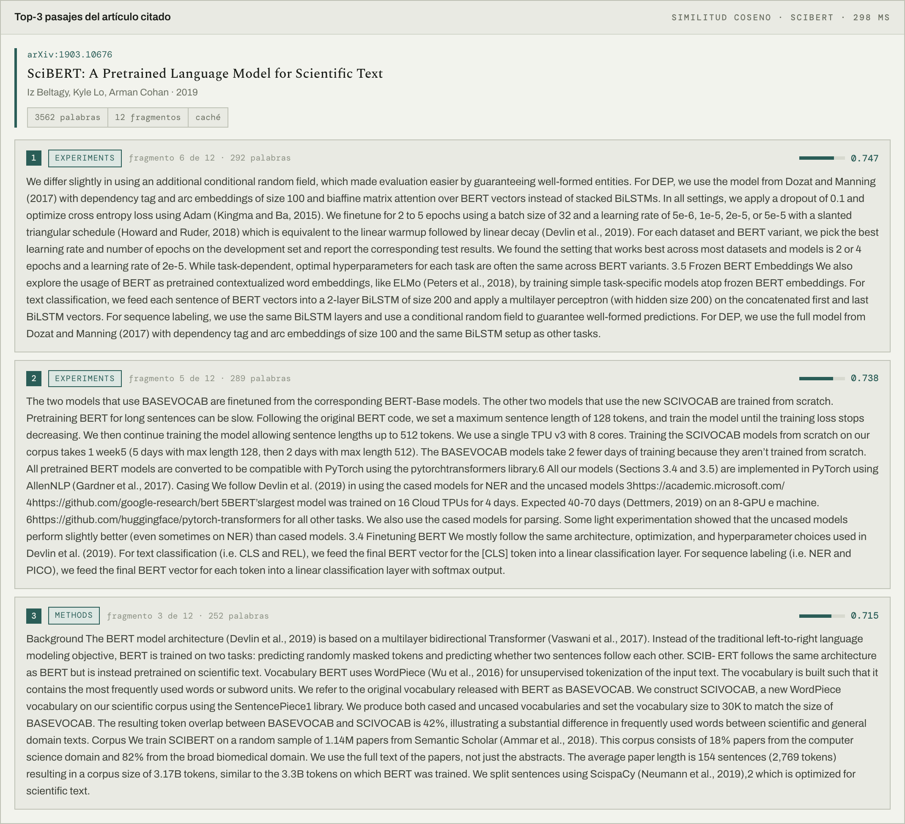
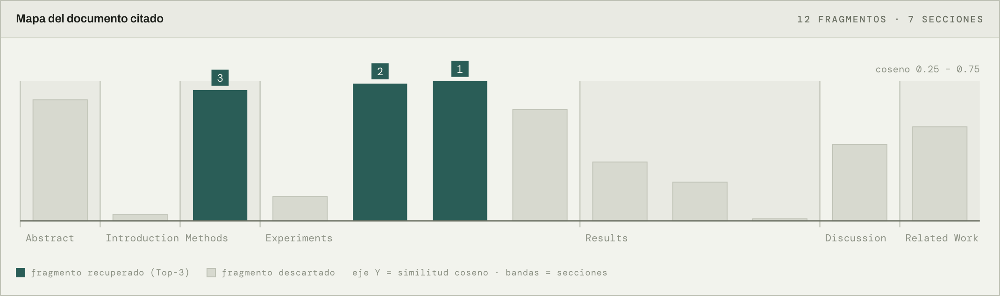
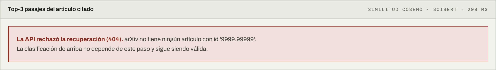

# Manual de usuario del tablero

## Para qué sirve

Al leer un artículo científico uno se topa con referencias como *«… as shown by Devlin
et al. [4]»* y surgen dos preguntas: **¿para qué está citando esto?** y **¿qué parte
exactamente del trabajo citado lo respalda?**

Este tablero responde ambas:

1. **Clasifica la función retórica** de la cita entre nueve categorías.
2. **Recupera los tres pasajes** del artículo citado más cercanos a esa mención.

Está pensado para investigadores y asistentes de revisión de literatura. Funciona
**solo con textos en inglés**, que es el idioma del corpus con el que se entrenaron los
modelos.

Se abre en `http://localhost:8080` (o la IP del servidor donde esté desplegado).

---

## La pantalla

La interfaz tiene dos zonas: a la izquierda se define qué analizar, a la derecha
aparecen los resultados.

Arriba a la derecha, unas etiquetas indican el estado: **API conectada** (verde) o **API
no disponible** (rojo). También se puede alternar entre tema **claro** y **oscuro**.

---

## Cómo usarlo

### Paso 1 · Contexto de cita

Escribe o pega la oración en inglés que contiene la mención bibliográfica. Una o dos
oraciones bastan; es el fragmento que rodea al marcador de cita.

> *We extend SciBERT [4] with an additional classification head and fine-tune it on our
> corpus to improve accuracy.*

Debajo del campo verás el número de palabras y si se detectó un marcador (`[4]`,
`(2019)`, `et al.`).

Hay tres botones —**Ejemplo A**, **B** y **C**— que rellenan todos los campos con casos
listos para probar.

### Paso 2 · Sección retórica

Elige en qué sección del artículo aparece la cita: *Abstract*, *Introduction*,
*Related Work*, *Method*, *Experiments*, *Results*, *Discussion*, *Conclusion* u *Other*.

**No es un dato decorativo.** El modelo la recibe como parte de la entrada y cambia la
predicción: la misma frase en *Introduction* y en *Discussion* puede clasificarse
distinto, igual que ocurre al leer.

### Paso 3 · Clasificador

Dos modelos disponibles:

- **SciBERT fine-tuned** (marcado *Recomendado*): encoder especializado en texto
  científico. Es el que mejor desempeño obtuvo.
- **TF-IDF + Regresión Logística**: línea base. Responde más rápido pero acierta menos.
  Útil para comparar.

### Paso 4 · Documento citado *(opcional)*

Aquí se indica **qué artículo se está citando**, para poder recuperar sus pasajes. Dos
formas:

- **Identificador o URL de arXiv**: `1903.10676`, `arXiv:1903.10676v2` o
  `https://arxiv.org/abs/1903.10676`.
- **Pegar el texto**: pulsa *«Pegar el texto en su lugar»* y pega el artículo completo.
  Útil si no está en arXiv.

> **Si dejas este campo vacío solo se clasifica la función de la cita.** No es un error:
> el tablero simplemente omite los paneles de pasajes.

El sistema no adivina qué artículo corresponde a `[4]`: resolver esa referencia exige la
bibliografía del artículo que cita, que el sistema no tiene. Ese dato lo aporta quien lo
usa, igual que al bajar a la lista de referencias del PDF.

### Paso 5 · Clasificar

Pulsa **Clasificar** (o `Ctrl/Cmd + Enter` desde el campo de texto).

La clasificación aparece casi de inmediato. La recuperación de pasajes tarda más —hay
que descargar el PDF y procesarlo— y muestra su propio indicador de progreso. **La
primera consulta sobre un artículo puede tardar entre 5 y 15 segundos; las siguientes
sobre el mismo artículo son inmediatas** porque queda en caché.

---

## Cómo leer los resultados

### Función de cita predicha

La categoría asignada, su definición y un indicador de **confianza** entre 0 y 1.

Si las dos categorías más probables quedan muy cerca (diferencia menor a 0,10), aparece
un **aviso de ambigüedad** y el caso se marca como candidato a revisión humana. Es una
señal útil: significa que el modelo no está seguro, no que se haya equivocado.

### Las nueve categorías

| Categoría | Cuándo aplica |
|---|---|
| **Background** | Aporta contexto general o antecedentes del campo |
| **Gap** | Señala un vacío de investigación que justifica el trabajo |
| **Basis** | Es el punto de partida intelectual o metodológico |
| **Comparison** | Contrasta métodos, datos o resultados |
| **Application** | Usa un método o herramienta del citado sin modificarlo |
| **Modification / Improvement** | Adapta, extiende o mejora un método del citado |
| **Evidence** | Respalda empíricamente una afirmación o decisión |
| **Identification of the Originator** | Reconoce la fuente original de una idea |
| **Further Reading** | Remite a literatura adicional |

### Distribución sobre las nueve funciones

Las probabilidades de **todas** las categorías, no solo la ganadora. Permite ver cuándo
la decisión fue reñida y entre qué clases.

### Entrada efectiva enviada al modelo

Muestra el texto exacto que recibió el clasificador, incluido el separador `[SEC]` y la
sección normalizada. Sirve para comprobar que se analizó lo que se pretendía.

### Top-3 pasajes del artículo citado

Primero la ficha del artículo —identificador, título, autores, año, número de palabras y
de fragmentos—. Después los tres pasajes, cada uno con:

- su **posición** (*fragmento 5 de 12*),
- la **sección** de la que proviene,
- la **similitud coseno** con el contexto de cita (más alto, más relacionado).

### Mapa del documento citado

Una barra por cada fragmento del artículo, ordenadas como aparecen en el texto. Las
bandas de fondo separan las secciones y las barras oscuras marcan los tres elegidos.

De un vistazo muestra **dónde se concentra la evidencia**: si las barras altas están en
*Methods*, la cita apunta a cómo se hizo algo; si están en *Results*, a lo que se
encontró.

---

## Si algo sale mal

El tablero **nunca inventa un resultado**. Ante cualquier fallo retira la predicción
anterior y explica qué pasó, en lugar de dejar en pantalla un dato que podría leerse
como respuesta a lo que se acaba de escribir.

| Mensaje | Qué significa | Qué hacer |
|---|---|---|
| *No se pudo contactar la API* | El servicio no responde | Avisar a quien administra el despliegue |
| *Falta el contexto de cita* | El campo está vacío | Escribir el texto a analizar |
| *arXiv no tiene ningún artículo con id…* | Identificador inexistente | Revisarlo en arxiv.org |
| *… no es un identificador de arXiv válido* | Formato incorrecto | Usar `1903.10676` o la URL completa |
| *No se pudo descargar el PDF* | El artículo no tiene PDF, o el servidor no llega a arXiv | Usar la opción de pegar el texto |

Cuando falla la recuperación, **la clasificación sigue siendo válida**: el aviso lo dice
explícitamente y el resultado permanece en pantalla.

---

## Qué esperar del sistema

- **El modelo se equivoca.** Su F1-macro sobre el conjunto de prueba está en torno a
  0,64: aproximadamente **una de cada tres predicciones es incorrecta**. Es una ayuda
  para revisar literatura, no un veredicto. El aviso de ambigüedad y la distribución
  completa existen precisamente para juzgar cuánto fiarse de cada resultado.
- **Solo funciona en inglés.**
- **La extracción de PDF no es perfecta.** En tablas, fórmulas y textos a dos columnas
  los fragmentos pueden salir con palabras entremezcladas. El contenido sigue siendo
  legible y la similitud, útil.
- **Se requiere conexión a internet** para recuperar artículos de arXiv.
- Se ha observado una confusión sistemática: cuando el texto dice *«see X»* o *«we refer
  the reader to X»* y X es un autor conocido, el modelo tiende a responder
  *Identification of the Originator* en lugar de *Further Reading*.
